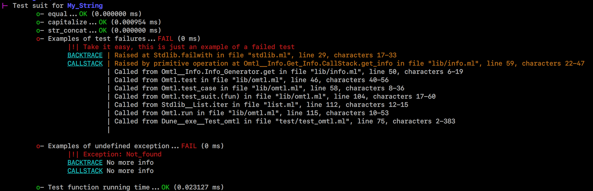

<div align="center">

# Omtl

__OCaml Minimalist Testing Library__


minimum version



  
---

This is not a comprehensive test framework, just a library, about a hundred lines in size, containing only a few functions. The purpose is to provide an intuitive command line interface and write simple tests quickly.
  
</div>

## Usage
[./test/test_omtl.ml](./test/test_omtl.ml)
```ocaml
(* A module with functions to test *)
module My_String = struct
  let equal = String.equal
  let capitalize = String.capitalize_ascii
  let str_concat = String.concat ""
end

(* The tests *)
let test_equal () =
  if My_String.equal "hello!" "hello!"
  then ()
  else fail "My_String.equal \"hello!\" = \"hello!\""
;;

let test_capitalize () =
  if String.equal "HELLO!" (My_String.capitalize "hELLO!")
  then ()
  else fail "My_String.capitalize \"hELLO!\" = \"HELLO!!\""
;;

let test_str_concat () =
  if String.equal "foobar" (My_String.str_concat [ "foo"; "bar" ])
  then ()
  else fail "My_String.str_concat [\"foo\"; \"bar\"] = \"foobar\""
;;

let test_failure () = fail "Take it easy, this is just an example of a failed test"
let test_undefined_exception () = raise Not_found
let test_function_running_time () = Unix.sleep 1

let _ =
  "My_String withall"
  +:> [ "equal" >== test_equal
      ; "capitalize" >== test_capitalize
      ; "str_concat" >== test_str_concat
      ; "Examples of test failures" >== test_failure
      ; "Examples of undefined exception" >== test_undefined_exception
      ; "Test function running time" >== test_function_running_time
      ]
  |> run ~color:true ~backtrace:true ~callstack:true
;;
```

## License
Copyright (c) 2023 Muqiu Han

All rights reserved.

Redistribution and use in source and binary forms, with or without modification,
are permitted provided that the following conditions are met:

    * Redistributions of source code must retain the above copyright notice,
      this list of conditions and the following disclaimer.
    * Redistributions in binary form must reproduce the above copyright notice,
      this list of conditions and the following disclaimer in the documentation
      and/or other materials provided with the distribution.
    * Neither the name of omtl nor the names of its contributors
      may be used to endorse or promote products derived from this software
      without specific prior written permission.

THIS SOFTWARE IS PROVIDED BY THE COPYRIGHT HOLDERS AND CONTRIBUTORS
"AS IS" AND ANY EXPRESS OR IMPLIED WARRANTIES, INCLUDING, BUT NOT
LIMITED TO, THE IMPLIED WARRANTIES OF MERCHANTABILITY AND FITNESS FOR
A PARTICULAR PURPOSE ARE DISCLAIMED. IN NO EVENT SHALL THE COPYRIGHT OWNER OR
CONTRIBUTORS BE LIABLE FOR ANY DIRECT, INDIRECT, INCIDENTAL, SPECIAL,
EXEMPLARY, OR CONSEQUENTIAL DAMAGES (INCLUDING, BUT NOT LIMITED TO,
PROCUREMENT OF SUBSTITUTE GOODS OR SERVICES; LOSS OF USE, DATA, OR
PROFITS; OR BUSINESS INTERRUPTION) HOWEVER CAUSED AND ON ANY THEORY OF
LIABILITY, WHETHER IN CONTRACT, STRICT LIABILITY, OR TORT (INCLUDING
NEGLIGENCE OR OTHERWISE) ARISING IN ANY WAY OUT OF THE USE OF THIS
SOFTWARE, EVEN IF ADVISED OF THE POSSIBILITY OF SUCH DAMAGE.